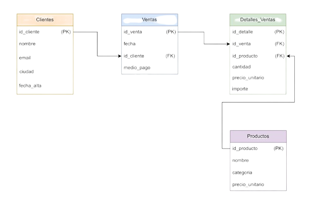

# Proyecto Aurelion - Análisis de Ventas y Segmentación de Clientes

**Aurelion Analytics** es una solución integral de inteligencia de negocios y ciencia de datos diseñada para analizar patrones de ventas, segmentar clientes y optimizar la toma de decisiones estratégicas en un entorno minorista.

Este proyecto transforma datos transaccionales crudos en insights accionables a través de un pipeline de ETL, modelado de machine learning y un dashboard interactivo.



---

## 📜 Descripción del Proyecto

El proyecto se centra en "Aurelion", una tienda ficticia, para la cual se ha desarrollado una solución completa que abarca desde la ingesta y procesamiento de datos hasta la visualización y el modelado predictivo. Los componentes principales son:

1.  **Pipeline de Datos (ETL):** Un proceso robusto que extrae datos de una base de datos relacional, los limpia, transforma y prepara para análisis y modelado.
2.  **Machine Learning:**
    *   **Segmentación de Clientes:** Utiliza análisis RFM (Recencia, Frecuencia, Monetario) y clustering K-Means para identificar segmentos de clientes clave como "Clientes VIP", "Clientes en Riesgo", etc.
    *   **Clasificación de Ventas:** Un modelo de Random Forest que predice si una transacción será de "alto valor".
    *   **Análisis de Cesta de la Compra:** Implementa el algoritmo Apriori para descubrir qué productos se compran juntos con frecuencia.
3.  **Dashboard Interactivo:** Una aplicación web desarrollada con Dash y Plotly que permite a los usuarios de negocio explorar los datos de ventas, filtrar por dimensiones clave y visualizar métricas de rendimiento en tiempo real.
4.  **Visor de Documentación:** Una utilidad de línea de comandos para navegar por la documentación técnica del proyecto de forma estructurada.

---

## ✨ Características Principales

- **Análisis RFM Completo:** Segmentación de clientes basada en su comportamiento de compra.
- **Modelos Predictivos:** Clasificación de ventas y pronóstico de comportamiento del cliente.
- **Dashboard Dinámico:** Visualizaciones interactivas de KPIs, análisis geográfico, Pareto, y más.
- **Pipeline de Datos Eficiente:** Uso de `polars` para un procesamiento de datos de alto rendimiento.
- **Arquitectura Modular:** Separación clara entre el procesamiento de datos, el modelado y la capa de visualización.
- **Documentación Integrada:** Scripts para facilitar la comprensión y el mantenimiento del proyecto.

---

## 🚀 Tecnologías Utilizadas

- **Lenguaje de Programación:** Python 3
- **Bases de Datos:** MySQL / MariaDB
- **Procesamiento de Datos:**
    - `pandas`
    - `polars`
- **Machine Learning:**
    - `scikit-learn`
    - `mlxtend`
- **Visualización de Datos:**
    - `plotly`
    - `seaborn`
    - `matplotlib`
- **Dashboard Web:**
    - `dash`
    - `Flask`
- **Entorno de Desarrollo:** Jupyter Notebook, VS Code

---

## 🏗️ Arquitectura del Proyecto

El proyecto está diseñado con una arquitectura modular que separa las responsabilidades:

1.  **Capa de Datos:** Una base de datos MySQL (`AurelionDB`) actúa como la fuente principal de verdad.
2.  **Capa de Procesamiento (ETL):** El notebook `Aurelion.ipynb` se encarga de la extracción, transformación y carga de los datos.
3.  **Capa de Inteligencia (Machine Learning):** El notebook `AurelionML.ipynb` consume los datos procesados para entrenar, evaluar y guardar los modelos de ML.
4.  **Capa de Presentación (Visualización):**
    *   `dashboard.py`: Ofrece una vista de alto nivel para el análisis de negocio.
    *   `visor_aurelion.py`: Proporciona una vista técnica de la documentación.

---

## ⚙️ Instalación y Puesta en Marcha

Sigue estos pasos para configurar y ejecutar el proyecto en tu entorno local.

### 1. Prerrequisitos

- Python 3.10 o superior.
- Un servidor de base de datos MySQL o MariaDB (se recomienda XAMPP para una configuración rápida).
- Git para clonar el repositorio.

### 2. Clonar el Repositorio

```bash
git clone https://github.com/Marbinseca/MSeca_Proyecto_Aurelion
cd MSeca_Proyecto_Aurelion
```

### 3. Configurar la Base de Datos

1.  Inicia tu servidor MySQL.
2.  Crea una nueva base de datos llamada `AurelionDB`.
3.  Importa el esquema y los datos iniciales ejecutando el script `BD/Aurelion_Normalizada.sql` en tu cliente de base de datos (por ejemplo, phpMyAdmin, DBeaver, etc.).

### 4. Crear y Activar un Entorno Virtual

Es una buena práctica trabajar en un entorno virtual para aislar las dependencias del proyecto.

```bash
# Crear el entorno
python -m venv env

# Activar en Windows
env\Scripts\activate

# Activar en macOS/Linux
source env/bin/activate
```

### 5. Instalar Dependencias

Instala todas las librerías necesarias utilizando el archivo `requirements.txt`.

```bash
pip install -r requirements.txt
```

---

## ▶️ Uso del Proyecto

Una vez configurado, puedes ejecutar los diferentes componentes del proyecto.

### 1. Ejecutar el Pipeline de Datos y Análisis

Abre y ejecuta el notebook `Aurelion.ipynb` en Jupyter. Esto procesará los datos de la base de datos y generará los archivos CSV necesarios para el modelado.

```bash
jupyter notebook Aurelion.ipynb
```

### 2. Ejecutar el Notebook de Machine Learning

Abre y ejecuta `AurelionML.ipynb`. Este notebook cargará los datos procesados, entrenará los modelos y guardará los artefactos (modelo `.joblib` y CSV de segmentación).

```bash
jupyter notebook AurelionML.ipynb
```

### 3. Lanzar el Dashboard de Business Intelligence

Para iniciar el dashboard web, ejecuta el siguiente comando en tu terminal:

```bash
python dashboard.py
```

El dashboard estará disponible en `http://127.0.0.1:8050`.

### 4. Consultar la Documentación Técnica

Para usar el visor de documentación desde la terminal:

```bash
python visor_aurelion.py
```

Se desplegará un menú interactivo para explorar las diferentes secciones de la documentación.

---

## 📂 Estructura del Proyecto

```
.
├── BD/                     # Scripts SQL para la base de datos
├── datos_exportados/       # Archivos CSV generados por los notebooks
├── env/                      # Entorno virtual de Python
├── static/                 # Imágenes para el README y dashboard
├── .gitignore
├── Aurelion.ipynb          # Notebook para ETL y análisis exploratorio
├── AurelionML.ipynb        # Notebook para Machine Learning
├── dashboard.py            # Aplicación del dashboard con Dash
├── DOCUMENTACION.md        # Documentación detallada del proyecto
├── requirements.txt        # Dependencias de Python
├── visor_aurelion.py       # CLI para visualizar la documentación
└── README.md               # Este archivo
```

---

## 👤 Autor

**Marbin Seca G**

- [LinkedIn](https://www.linkedin.com/in/marbin-seca-gomez-56842b265/)
- [GitHub](https://github.com/Marbinseca)

---

## 📄 Licencia

Este proyecto está bajo la Licencia MIT. Consulta el archivo `LICENSE` para más detalles.
